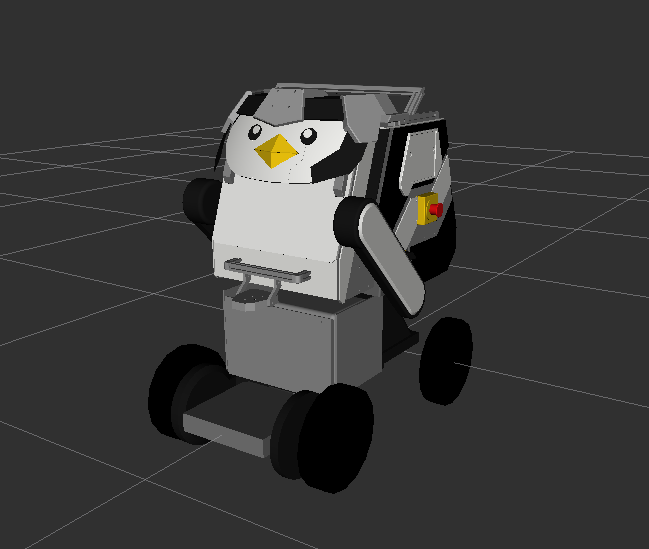

# kuams 🐧
ROS 2 package for KUAMS (Kansai University Autonomous Measurement System)



## Requirements
- Ubuntu 22.04 
- ROS2 humble
- [ros2_whill](https://github.com/kzm784/ros2_whill.git)
- [ros2_whill_interfaces (crystal-devel)](https://github.com/WHILL/ros2_whill_interfaces)
- [ira_laser_tools (humble)](https://github.com/kzm784/ira_laser_tools.git)
- [waypoint_manager](https://github.com/kzm784/waypoint_manager.git)
- [lidar_localization_ros2](https://github.com/kzm784/lidar_localization_ros2.git)
- [emcl2_ros2](https://github.com/CIT-Autonomous-Robot-Lab/emcl2_ros2.git)


## Build
please install before building
```sh
sudo apt install ros-humble-laser-filters
sudo apt install ros-humble-velodyne 
```
In your shell:
```sh
cd ~/<your_ros2_ws>/src
git clone https://github.com/kzm784/kuams.git
cd ~/<your_ros2_ws>
colcon build 
source install/setup.bash
