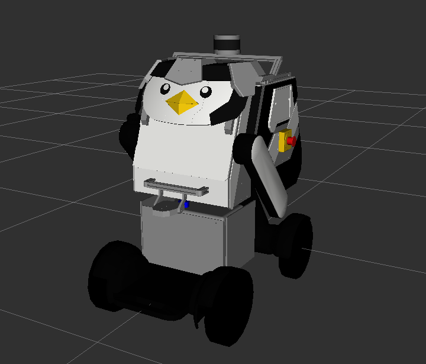

# kuams 🐧

KUAMS (Kansai University Autonomous Measurement System) ROS 2パッケージ



## 目次
- [概要](#概要)
- [ハードウェア & 開発環境](#ハードウェア--開発環境)
- [パッケージ構成](#パッケージ構成)
- [インストール方法](#インストール方法)
- [使用方法](#使用方法)

## 概要
**ROS 2** と **Navigation2** を用いて **Waypoint** ナビゲーションを行うためのパッケージを提供します。  
実機には関西大学 計測システム研究室が制作するKUAMSを使用します。

## ハードウェア & 開発環境
- ハードウェア
    - WHILL Model CR
        - 製品ページ: [https://whill.inc/jp/model-cr](https://whill.inc/jp/model-cr)
    - Livox Mid-360:
        - 製品ページ: [https://www.livoxtech.com/jp/mid-360](https://www.livoxtech.com/jp/mid-360)

- 開発環境
    - Ubuntu Linux - Jammy Jellyfish (22.04)
    - ROS 2 Humble Hawksbill

## パッケージ構成
- `kuams` : KUAMSのメタパッケージ
- `kuams_bringup` : KUAMS、各種センサの起動を行うためのlaunchファイルを提供するパッケージです。
- `kuams_description` : KUAMSの物理モデルやURDFモデル、Meshファイルを含むパッケージです。
- `kuams_navigation` : Nav2の起動を行うためのlaunchファイルを提供するパッケージです。
- `kuams_slam` : slam_toolboxを起動するためのlaunchファイルを提供するパッケージです。
- `kuams_teleop` : Joyコントローラを使用してKUAMS3を操作するためのコード、launchファイルを提供するパッケージです。

## インストール方法  
以下の手順に沿って各パッケージのインストールを行ってください  
1. **ROS 2 Humble**のセットアップ:  
   [こちら](https://docs.ros.org/en/humble/Installation.html)の手順に従って、ROS 2 Humbleをインストールしてください。

2. [**kuams**](https://github.com/kzm784/kuams) のセットアップ:
   ```bash
   mkdir -p ~/kuams_ws/src
   cd ~/kuams_ws/src
   git clone https://github.com/kzm784/kuams.git
   cd ~/kuams_ws
   rosdep update && rosdep install --from-paths src --ignore-src -y
   colcon build
    ```

3. [**ros2_whill**](https://github.com/kzm784/ros2_whill.git) のセットアップ:
    ```bash
    sudo apt install ros-humble-xacro
    cd ~/kuams_ws/src
    git clone https://github.com/whill-labs/ros2_whill_interfaces.git
    git clone https://github.com/kzm784/ros2_whill.git
    cd ~/kuams_ws
    rosdep update && rosdep install --from-paths src --ignore-src -y
    colcon build
    ```
4. [**Livox SDK2**](https://github.com/Livox-SDK/Livox-SDK2.git) のセットアップ:
   ```basht
   git clone https://github.com/Livox-SDK/Livox-SDK2.git
   cd ~/Livox-SDK2/
   mkdir build
   cd build
   cmake .. && make -j4
   sudo make install
   ```

5. [**livox_ros_driver2**](https://github.com/Livox-SDK/livox_ros_driver2) のセットアップ:
   ```bash
   cd ~/kuams_ws/src
   git clone https://github.com/Livox-SDK/livox_ros_driver2.git
   mv livox_ros_driver2/package_ROS2.xml livox_ros_driver2/package.xml
   cd ~/kuams_ws
   colcon build --packages-select livox_ros_driver2 --cmake-args -DROS_EDITION="ROS2" -DHUMBLE_ROS="humble" --symlink-install
    ```

6. [**waypoint_manager**](https://github.com/kzm784/waypoint_manager) のセットアップ:
    ```bash
   cd ~/kuams_ws/src
   git clone https://github.com/kzm784/waypoint_manager.git
   cd ~/kuams_ws
   rosdep update && rosdep install --from-paths src --ignore-src 
   colcon build
    ```

7. [**lidar_localization_ros2**](https://github.com/kzm784/lidar_localization_ros2.git) のセットアップ:
    ```bash
   cd ~/kuams_ws/src
   git clone https://github.com/kzm784/lidar_localization_ros2.git
   git clone https://github.com/rsasaki0109/ndt_omp_ros2.git
   cd ~/kuams_ws
   rosdep update && rosdep install --from-paths src --ignore-src 
   colcon build
    ```

## 使用方法
- **KUAMSの起動**:    
    ⚠️ **注意**: 初期セットアップ時にudevルールを編集し、USBデバイスのシンボリックリンクを作成してください。
    ```bash
    sudo mv ~/kuams_ws/src/kuams/docs/99-whill-serial.rules /etc/udev/rules.d/
    sudo udevadm control --reload
    ```
    WHILL Model CRとPCをシリアル接続し、以下のコマンドを実行して各種センサを含むkuamsの実機を起動します。
    ```bash
    cd kuams_ws
    source install/setup.bash
    ros2 launch kuams_bringup kuams.launch.py
    ```

- **Joyコントローラーを用いたKUAMSの操縦**:
    JoyコントローラーとPCを接続した後、以下のコマンドを実行しKUAMSを操縦することができます。
    ```bash
    cd kuams_ws
    source install/setup.bash
    ros2 launch kuams_teleop kuams3_teleop_joy.launch.py
    ```

- **Navigation2を用いたウェイポイントナビゲーション**:  
    1.  **事前準備**:  
        ホームディレクトリに `navigation_data` ディレクトリを作成し、ウェイポイントナビゲーションに必要なデータをその中に準備してください。
        ```
        navigation_data/
            │
            ├── rinpukan/
            │       ├── rinpukan.pcd        # 3次元地図
            │       ├── rinpukan.pgm        # 2次元地図
            │       ├── rinpukan.yaml       # 2次元地図情報設定ファイル
            │       ├── rinpukan_wp.csv     # ウェイポイントデータ
            │
            └── ... # 以降も同じ形式
        ```
        
    2. **lidar_localization_ros2の起動**:  
        KUAMSを起動後、以下のコマンドで lidar_localization_ros2 を起動します
        ```bash
        cd  ~/kuams_ws
        source install/setup.bash
        ros2 launch kuams_navigation lidar_localization_ros2.launch.py    
        ```

    3. **Nav2の起動**:  
        KUAMS, lidar_localization_ros2 を起動後、以下のコマンドで Nav2 を起動します
       `map:=` 以降にナビゲーションで使用する2D地図の `.yaml` ファイルを指定してください
        ```bash
        cd ~/kuams_ws
        source install/setup.bash
        ros2 launch kuams_navigation navigation.launch.py map:=path/to/your/map.yaml
        ```

    5. **waypoint_managerの起動**:  
        Nav2の起動後、以下のコマンドでwaypoint_managerを起動します
       `waypionts:=` 以降にナビゲーションで使用するウェイポイントの `.csv` ファイルを指定してください
        ```bash
        cd ~/kuams_ws
        source install/setup.bash
        ros2 launch waypoint_manager waypoint_manager.launch.py waypoints:=path/to/your/waypoints.csv
        ```
